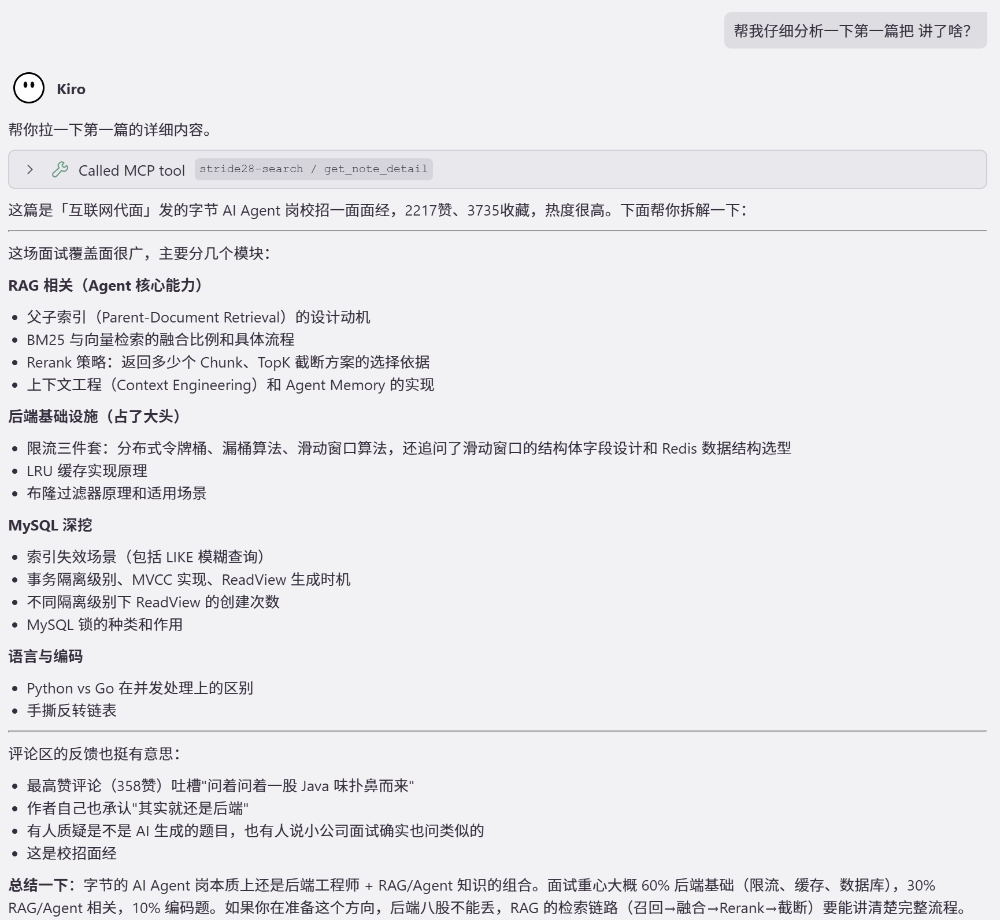

<p align="center">
  
</p>

<h3 align="center">Search MCP</h3>

<p align="center">
  中文社区经验聚合搜索 MCP Server — 让 AI 助手直接搜索小红书和知乎的真实内容
</p>

<p align="center">
  <a href="https://pypi.org/project/stride28-search-mcp/">
    
  </a>
  <a href="https://github.com/BrunonXU/Stride28-search-mcp/blob/main/LICENSE">
    
  </a>
  
</p>

<p align="center">
  <a href="#使用场景">使用场景</a> · <a href="#安装">安装</a> · <a href="#配置">配置</a> · <a href="#可用-tool">Tool 参考</a> · <a href="#错误码">错误码</a>
</p>

---

> 这是 [Stride28](https://github.com/BrunonXU/Stride28) 智能学习平台的搜索模块，独立抽出来作为 MCP 工具。

## 演示

<p align="center">
  
</p>

<p align="center">
  
</p>

<!-- TODO: WorkBuddy + Claw 自动化演示
<p align="center">
  
</p>
<p align="center">
  
</p>
-->

## 使用场景

跟 AI 助手说：

- "帮我搜小红书上关于 RAG 的面试题"
- "看看那篇笔记的详细内容和评论"
- "去知乎搜搜 Agent 开发相关的讨论"
- "只搜小红书的视频笔记"
- "获取知乎这个问题的完整回答，不要截断"

AI 会自动调用对应的 MCP tool。首次使用时会弹出浏览器让你完成登录。

## 安装

Python 3.10+

```bash
# uv（推荐）
uv tool install stride28-search-mcp

# 或 pipx
pipx install stride28-search-mcp
```

安装浏览器：

```bash
stride28-search-mcp install-browser
```

## 配置

在 MCP 客户端配置中添加：

```json
{
  "mcpServers": {
    "stride28-search": {
      "command": "stride28-search-mcp",
      "disabled": false
    }
  }
}
```

<details>
<summary>用 uvx 免安装运行</summary>

```json
{
  "mcpServers": {
    "stride28-search": {
      "command": "uvx",
      "args": ["stride28-search-mcp"],
      "disabled": false
    }
  }
}
```

</details>

兼容：[Kiro](https://kiro.dev) · [Cursor](https://cursor.sh) · [Claude Code](https://docs.anthropic.com/en/docs/claude-code) · [VS Code + Copilot](https://code.visualstudio.com/) · 任何支持 MCP stdio transport 的客户端

## 可用 Tool

| Tool | 平台 | 说明 |
|------|------|------|
| `login_xiaohongshu` | 小红书 | 扫码登录，Cookie 持久化 |
| `search_xiaohongshu` | 小红书 | 关键词搜索，支持图文/视频过滤 |
| `get_note_detail` | 小红书 | 笔记详情 + 评论翻页 + 发布时间 |
| `login_zhihu` | 知乎 | 手动登录 |
| `search_zhihu` | 知乎 | 关键词搜索（问答/专栏/视频） |
| `get_zhihu_question` | 知乎 | Top N 回答，内容长度可配置 |

<details>
<summary>参数详情</summary>

### search_xiaohongshu

| 参数 | 类型 | 默认值 | 说明 |
|------|------|--------|------|
| `query` | string | 必填 | 搜索关键词 |
| `limit` | int | 10 | 返回条数 |
| `note_type` | string | `"all"` | `"all"` / `"normal"` / `"video"` |

### get_note_detail

| 参数 | 类型 | 默认值 | 说明 |
|------|------|--------|------|
| `note_id` | string | 必填 | 笔记 ID |
| `xsec_token` | string | `""` | 安全 token |
| `max_comments` | int | 50 | 最大评论数 |

### get_zhihu_question

| 参数 | 类型 | 默认值 | 说明 |
|------|------|--------|------|
| `question_id` | string | 必填 | 问题 ID |
| `limit` | int | 5 | 回答数 |
| `max_content_length` | int | 10000 | 最大字符数，`0` = 不截断 |

</details>

## 错误码

所有错误返回统一 JSON，包含 `retryable` 字段供 agent 判断是否重试。

| 错误码 | 含义 | 可重试 | 怎么办 |
|--------|------|:------:|--------|
| `login_required` | 未登录 | ✗ | 调用 login tool |
| `login_timeout` | 登录超时 | ✓ | 重新登录 |
| `search_timeout` | 搜索超时 | ✓ | 稍后重试 |
| `browser_init_failed` | 浏览器启动失败 | ✗ | `stride28-search-mcp install-browser` |
| `browser_crashed` | 浏览器崩溃 | ✗ | 重启 MCP Server |
| `captcha_detected` | 验证码拦截 | ✗ | 等待后重试 |
| `unknown_error` | 未知错误 | ✗ | 查看日志 |

## 环境变量

| 变量 | 默认值 | 说明 |
|------|--------|------|
| `STRIDE28_SEARCH_MCP_HOME` | `~/.stride28-search-mcp` | 数据目录 |
| `STRIDE28_RATE_LIMIT_SECONDS` | `2.0` | 请求最小间隔（秒） |

## 开发

详见 [ARCHITECTURE.md](ARCHITECTURE.md)

## License

MIT
